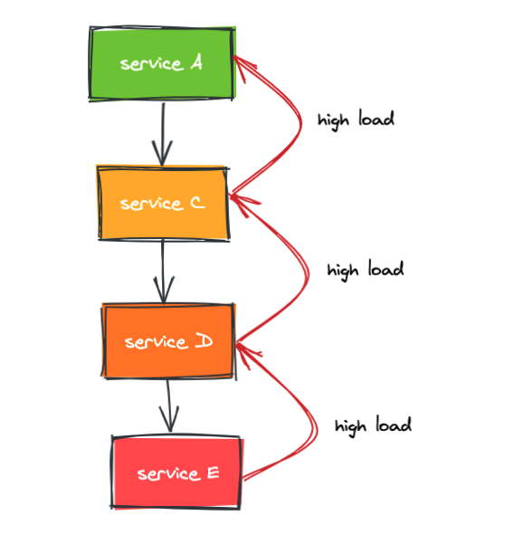
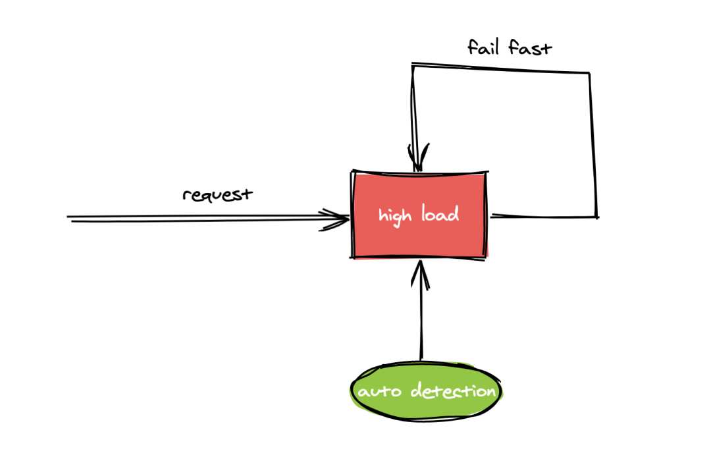

# 微服务过载保护原理与实战

在微服务中由于服务间相互依赖很容易出现连锁故障，连锁故障可能是由于整个服务链路中的某一个服务出现故障，进而导致系统的其他部分也出现故障。例如某个服务的某个实例由于过载出现故障，导致其他实例负载升高，从而导致这些实例像多米诺骨牌一样一个个全部出现故障，这种连锁故障就是所谓的雪崩现象。

比如，服务A依赖服务C，服务C依赖服务D，服务D依赖服务E，当服务E过载会导致响应时间变慢甚至服务不可用，这个时候调用方D会出现大量超时连接资源被大量占用得不到释放，进而资源被耗尽导致服务D也过载，从而导致服务C过载以及整个系统雪崩。



某一种资源的耗尽可以导致高延迟、高错误率或者相应数据不符合预期的情况发生，这些的确是在资源耗尽时应该出现的情况，在负载不断上升直到过载时，服务器不可能一直保持完全的正常。而CPU资源的不足导致的负载上升是我们工作中最常见的，如果CPU资源不足以应对请求负载，一般来说所有的请求都会变慢，CPU负载过高会造成一系列的副作用，主要包括以下几项：

* 正在处理的(in-flight) 的请求数量上升
* 服务器逐渐将请求队列填满，意味着延迟上升，同时队列会用更多的内存
* 线程卡住，无法处理请求
* cpu死锁或者请求卡主
* rpc服务调用超时
* cpu的缓存效率下降

由此可见防止服务器过载的重要性不言而喻，而防止服务器过载又分为下面几种常见的策略：

* 提供降级结果
* 在过载情况下主动拒绝请求
* 调用方主动拒绝请求
* 提前进行压测以及合理的容量规划

今天我们主要讨论的是第二种防止服务器过载的方案，即在过载的情况下主动拒绝请求，下面我统一使用”过载保护“来表述，过载保护的大致原理是当探测到服务器已经处于过载时则主动拒绝请求不进行处理，一般做法是快速返回error



很多微服务框架中都内置了过载保护能力，本文主要分析go-zero中的过载保护功能，我们先通过一个例子来感受下go-zero的中的过载保护是怎么工作的

首先，我们使用官方推荐的goctl生成一个api服务和一个rpc服务，生成服务的过程比较简单，在此就不做介绍，可以参考官方文档，我的环境是两台服务器，api服务跑在本机，rpc服务跑在远程服务器

远程服务器为单核CPU，首先通过压力工具模拟服务器负载升高，把CPU打满
```
stress -c 1 -t 1000
```
此时通过uptime工具查看服务器负载情况，-d参数可以高亮负载的变化情况，此时的负载已经大于CPU核数，说明服务器正处于过载状态
```
watch -d uptime
19:47:45 up 5 days, 21:55,  3 users,  load average: 1.26, 1.31, 1.44
```
此时请求api服务，其中ap服务内部依赖rpc服务，查看rpc服务的日志，级别为stat，可以看到cpu是比较高的
```
"level":"stat","content":"(rpc) shedding_stat [1m], cpu: 986, total: 4, pass: 2, drop: 2"
```
并且会打印过载保护丢弃请求的日志，可以看到过载保护已经生效，主动丢去了请求
```
adaptiveshedder.go:185 dropreq, cpu: 990, maxPass: 87, minRt: 1.00, hot: true, flying: 2, avgFlying: 2.07
```
这个时候调用方会收到 "service overloaded" 的报错

通过上面的试验我们可以看到当服务器负载过高就会触发过载保护，从而避免连锁故障导致雪崩，接下来我们从源码来分析下过载保护的原理，go-zero在http和rpc框架中都内置了过载保护功能，代码路径分别在go-zero/rest/handler/sheddinghandler.go和go-zero/zrpc/internal/serverinterceptors/sheddinginterceptor.go下面，我们就以rpc下面的过载保护进行分析，在server启动的时候回new一个shedder 代码路径: go-zero/zrpc/server.go:119， 然后当收到每个请求都会通过Allow方法判断是否需要进行过载保护，如果err不等于nil说明需要过载保护则直接返回error
```
promise, err = shedder.Allow()
if err != nil {
  metrics.AddDrop()
  sheddingStat.IncrementDrop()
  return
}
```
实现过载保护的代码路径为: go-zero/core/load/adaptiveshedder.go，这里实现的过载保护基于滑动窗口可以防止毛刺，有冷却时间防止抖动，当CPU>90%的时候开始拒绝请求，Allow的实现如下
```
func (as *adaptiveShedder) Allow() (Promise, error) {
    if as.shouldDrop() {
        as.dropTime.Set(timex.Now())
        as.droppedRecently.Set(true)

        return nil, ErrServiceOverloaded  // 返回过载错误
    }

    as.addFlying(1) // flying +1

    return &promise{
        start:   timex.Now(),
        shedder: as,
    }, nil
}
```
shouldDrop实现如下，该函数用来检测是否符合触发过载保护条件，如果符合的话会记录error日志
```
func (as *adaptiveShedder) shouldDrop() bool {
    if as.systemOverloaded() || as.stillHot() {
        if as.highThru() {
            flying := atomic.LoadInt64(&as.flying)
            as.avgFlyingLock.Lock()
            avgFlying := as.avgFlying
            as.avgFlyingLock.Unlock()
            msg := fmt.Sprintf(
                "dropreq, cpu: %d, maxPass: %d, minRt: %.2f, hot: %t, flying: %d, avgFlying: %.2f",
                stat.CpuUsage(), as.maxPass(), as.minRt(), as.stillHot(), flying, avgFlying)
            logx.Error(msg)
            stat.Report(msg)
            return true
        }
    }

    return false
}
```
判断CPU是否达到预设值，默认90%
```
systemOverloadChecker = func(cpuThreshold int64) bool {
    return stat.CpuUsage() >= cpuThreshold
}
```
CPU的负载统计代码如下，每隔250ms会进行一次统计，每一分钟会记录一次统计日志
```
func init() {
    go func() {
        cpuTicker := time.NewTicker(cpuRefreshInterval)
        defer cpuTicker.Stop()
        allTicker := time.NewTicker(allRefreshInterval)
        defer allTicker.Stop()

        for {
            select {
            case <-cpuTicker.C:
                threading.RunSafe(func() {
                    curUsage := internal.RefreshCpu()
                    prevUsage := atomic.LoadInt64(&cpuUsage)
                    // cpu = cpuᵗ⁻¹ * beta + cpuᵗ * (1 - beta)
                    usage := int64(float64(prevUsage)*beta + float64(curUsage)*(1-beta))
                    atomic.StoreInt64(&cpuUsage, usage)
                })
            case <-allTicker.C:
                printUsage()
            }
        }
    }()
}
```
其中CPU统计实现的代码路径为: go-zero/core/stat/internal，在该路径下使用linux结尾的文件，因为在go语言中会根据不同的系统编译不同的文件，当为linux系统时会编译以linux为后缀的文件
```
func init() {
    cpus, err := perCpuUsage()
    if err != nil {
        logx.Error(err)
        return
    }

    cores = uint64(len(cpus))
    sets, err := cpuSets()
    if err != nil {
        logx.Error(err)
        return
    }

    quota = float64(len(sets))
    cq, err := cpuQuota()
    if err == nil {
        if cq != -1 {
            period, err := cpuPeriod()
            if err != nil {
                logx.Error(err)
                return
            }

            limit := float64(cq) / float64(period)
            if limit < quota {
                quota = limit
            }
        }
    }

    preSystem, err = systemCpuUsage()
    if err != nil {
        logx.Error(err)
        return
    }

    preTotal, err = totalCpuUsage()
    if err != nil {
        logx.Error(err)
        return
    }
}
```
在linux中，通过/proc虚拟文件系统向用户控件提供了系统内部状态的信息，而/proc/stat提供的就是系统的CPU等的任务统计信息，这里主要原理就是通过/proc/stat来计算CPU的使用率

本文主要介绍了过载保护的原理，以及通过实验触发了过载保护，最后分析了实现过载保护功能的代码，相信通过本文大家对过载保护会有进一步的认识，过载保护不是万金油，对服务来说是有损的，所以在服务上线前我们最好是进行压测做好资源规划，尽量避免服务过载